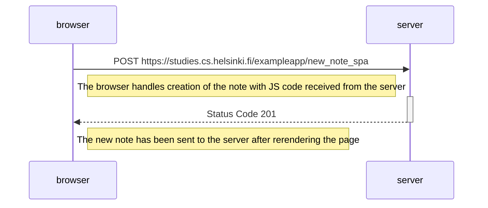

```mermaid
sequenceDiagram
    participant browser
    participant server

    browser->>server: POST https://studies.cs.helsinki.fi/exampleapp/new_note_spa
    Note right of browser: The browser handles creation of the note with JS code received from the server
    activate server
    server-->>browser: Status Code 201
    deactivate server

    Note right of browser: The new note has been sent to the server after rerendering the page

    
```